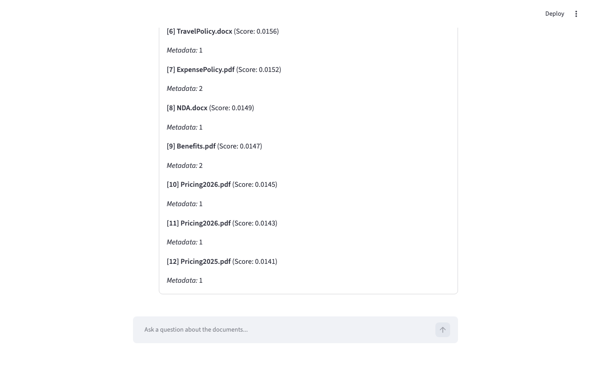
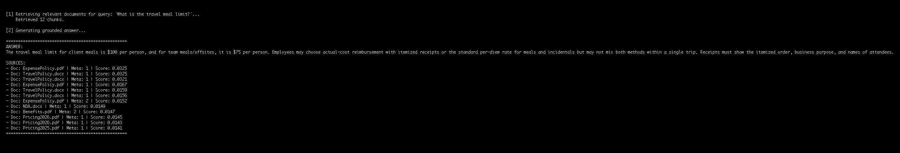
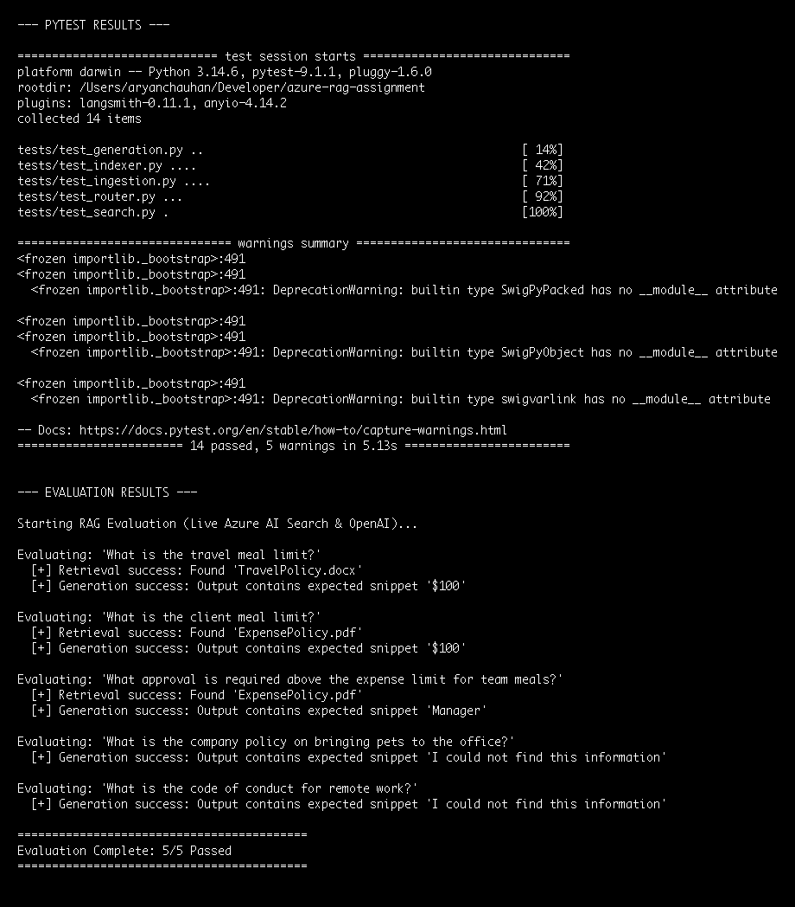

# Azure RAG Assignment

A portfolio-quality Retrieval-Augmented Generation (RAG) pipeline built with Python, Azure OpenAI, and Azure AI Search. Features Streamlit UI, hybrid search query routing, automated evaluation, and CI/CD via GitHub Actions.

## 1. Project Overview
This project ingests company documents (PDFs, DOCX, XLSX) and builds a fully functional RAG system allowing users to query information conversationally. It incorporates strong anti-hallucination guardrails and intelligent query routing.

## Demo
Here are screenshots of the actual working project:

### Streamlit UI


### RAG CLI Output


### Automated Evaluation & Tests


## 2. Architecture
```text
Documents
 ↓
Ingestion (PDF/DOCX/XLSX to Chunks)
 ↓
Azure OpenAI Embeddings (text-embedding-3-small)
 ↓
Azure AI Search (rag-index)
 ↓
Query Routing (Conversational Bypass)
 ↓
Vector/Hybrid Retrieval (HNSW + BM25)
 ↓
Optional Reranking (Future Enhancement)
 ↓
Azure OpenAI Chat (gpt-4.1-mini)
 ↓
Grounded Answer & Sources
```

## 3. Features
- **Document Ingestion**: Seamless extraction and semantic chunking of text preserving page and row-level metadata.
- **Hybrid Retrieval**: Employs both dense vector search and keyword BM25 search to maximize context recall.
- **Query Routing**: Intercepts casual conversational queries (e.g., "Hi", "Thank you") to save API costs and improve UX without unnecessary RAG retrieval.
- **Strict Grounding**: System prompts enforce absolute reliance on retrieved context; out-of-scope questions are explicitly met with "I could not find this information...".
- **Streamlit UI**: A clean, professional web interface featuring chat history and expandable source citations.

## 4. Technology Stack
- **Language**: Python 3.10+
- **AI Services**: Azure OpenAI (Embeddings & Chat Completions)
- **Search**: Azure AI Search (Vector + Hybrid)
- **UI**: Streamlit
- **Testing & CI**: Pytest, GitHub Actions

## 5. Project Structure
- `data/`: Sample raw documents organized by department.
- `src/ingestion/`: Modules to parse and chunk diverse document types.
- `src/retrieval/`: Search index creation, embedding generation, and vector retrieval.
- `src/generation/`: LLM integration, query routing, and strict grounding prompts.
- `app.py`: Streamlit web interface.
- `src/rag.py`: Main CLI for end-to-end question answering.
- `evaluation/`: Automated RAG evaluation dataset and runner.
- `tests/`: Fully mocked unit test suite.

## 6. Setup Instructions
1. Setup a Python virtual environment and install dependencies:
   ```bash
   python3 -m venv .venv
   source .venv/bin/activate
   pip install -r requirements.txt
   ```
2. Configure your Azure variables in a `.env` file (see `.env.example` for reference). **DO NOT commit `.env`.**

## 7. Environment Variables
Requires an Azure AI Search instance and an Azure OpenAI resource with both an embedding deployment and a chat deployment.
```env
AZURE_SEARCH_ENDPOINT="https://<your-service>.search.windows.net"
AZURE_SEARCH_ADMIN_KEY="<your-admin-key>"
AZURE_SEARCH_INDEX_NAME="rag-index"

AZURE_OPENAI_ENDPOINT="https://<your-resource>.services.ai.azure.com/openai/v1"
AZURE_OPENAI_API_KEY="<your-api-key>"
AZURE_OPENAI_API_VERSION="2024-10-21"
AZURE_OPENAI_EMBEDDING_DEPLOYMENT="text-embedding-3-small"
AZURE_OPENAI_CHAT_DEPLOYMENT="gpt-4.1-mini"
SEARCH_MODE="hybrid"
```

## 8. Document Ingestion & 9. Indexing
Run this when data changes to parse the `data/` directory and synchronize chunks with Azure AI Search:
```bash
.venv/bin/python src/retrieval/indexer.py
```

## 10. Hybrid Retrieval & 11. RAG Generation
Ask questions via the terminal to trigger the complete pipeline:
```bash
PYTHONPATH=. .venv/bin/python src/rag.py "What is the travel meal limit?"
```

## 12. Grounded Refusal Behavior
The pipeline will safely refuse questions not supported by the data:
```bash
PYTHONPATH=. .venv/bin/python src/rag.py "What is the company policy on bringing pets to the office?"
```

## 13. Streamlit Usage
Launch the interactive web interface:
```bash
.venv/bin/streamlit run app.py
```

## 14. Evaluation
A lightweight evaluation framework tests retrieval accuracy and groundedness on real Azure services against a ground-truth dataset.
- **Verified Results**: 5/5 live evaluation cases passed.
```bash
PYTHONPATH=. .venv/bin/python evaluation/evaluate.py
```

## 15. Testing & 16. GitHub Actions CI
Unit tests execute locally and are fully mocked to prevent unexpected Azure costs.
- **Verified Results**: 14/14 unit tests passed.
```bash
PYTHONPATH=. .venv/bin/python -m pytest
```
GitHub Actions is configured (`.github/workflows/tests.yml`) to automatically run the test suite on pushes and PRs to `main`.

## 17. Security
- The `.env` file containing API keys is ignored by Git (`.gitignore`).
- Code defensively handles missing configuration.
- CI pipelines use mocked services, preventing credential leaks.

## 18. Limitations
- Azure AI Search index requires manual schema management and update scripts when metadata structures change.

## 19. Future Improvements
- **Semantic Reranking**: Azure AI Search offers a native Semantic Ranker. This is currently deferred as a future enhancement because it requires specific Azure service tiers (Standard) and enabling semantic configurations on the index, which incurs extra infrastructure setup and costs outside this project's scope.
